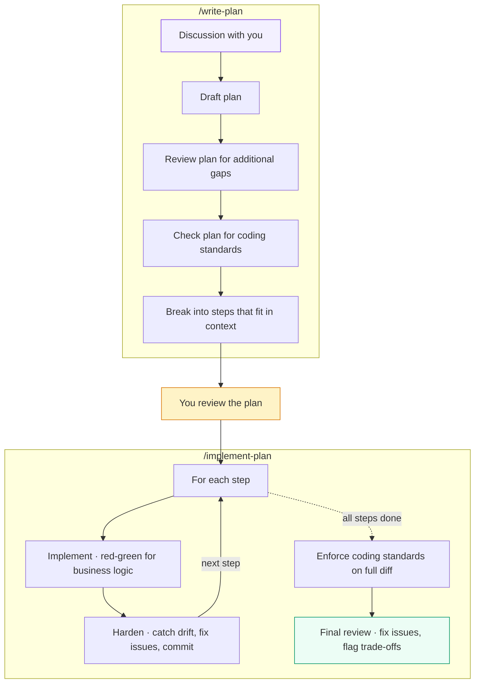

# spec-driven-dev

Your plan, fresh agents, zero drift.

[](#whats-in-this-repo)
[](https://docs.anthropic.com/en/docs/claude-code)

A structured workflow for AI-assisted development: from discussion to reviewed, tested, standards-compliant code, through a version-controlled plan. 2 skills, 7 agents, ~800 lines of markdown. No code, no config, no state directories. Just prompts.

## Prerequisites

- [Claude Code](https://docs.anthropic.com/en/docs/claude-code) (requires a Max/Team subscription or API key)

## Install

```bash
/plugin marketplace add mkrtchian/spec-driven-dev
/plugin install spec-driven-dev@mkrtchian
```

## Usage

```bash
# 1. Discuss the feature, draft and review the plan
/write-plan

# 2. Review the plan yourself, adjust if needed

# 3. Execute the plan step by step
/clear
/implement-plan plans/YYYY-MM-DD_my-feature.md
```

## The problem

AI coding assistants hit two walls on non-trivial changes:

1. **They don't know what to build.** The more autonomy you give them, the more they drift from your intent. Without a precise spec, you spend more time correcting than you save.
2. **Context degrades.** A single conversation that discusses requirements, writes code, runs tests, and reviews standards will do all of these poorly. The agent loses focus as context fills up, and large changes exceed what fits in one pass.

## The approach

Two skills, each orchestrating fresh agents with isolated context. Each agent starts with a fresh context window, focused on a single concern. No attention pollution between phases.



## Design decisions

**Isolated passes.** A single agent asked to "implement this plan, follow TDD, and check coding standards" will do all three poorly. An agent that just spent 20 minutes implementing code is not in the right mindset to review standards: it's biased toward defending what it just wrote. Fresh context per concern, same principle as code review. For the detailed rationale, see [workflow.md](docs/workflow.md#why-isolated-context).

**Plans in git.** Your plan is a plain markdown file. It goes through your normal PR review process. No special directories, no hidden state. Two developers can plan and implement different features on different branches without interfering.

**Sequential execution.** Each pass builds on verified state. Simpler to reason about, debug, and review. Parallel execution saves time but adds coordination complexity that isn't worth it for single-feature work.

**Dynamic discovery over configuration.** Skills detect your project's test runner, linter, and standards by finding and reading `CLAUDE.md` and other relevant files. Nothing is hardcoded to a stack.

**Conditional TDD.** Business logic gets test-first. Glue code, wiring, and config changes don't. This matches how experienced developers actually work.

**Step hardening.** After each implementation step, a fresh agent verifies alignment with the plan and fixes emergent issues. Problems are caught early, not discovered at the end.

## Example plans

The [mcp-auditor](https://github.com/mkrtchian/mcp-auditor) project was built using this workflow. Its [plans/](https://github.com/mkrtchian/mcp-auditor/tree/main/plans) directory contains 15+ real plans, from domain modeling to CLI UX to OWASP mapping, showing what the output of `/write-plan` looks like in practice.

## Who is this for

- Developers working on non-trivial features where AI "just do it" approaches produce drift and rework
- Teams that do code review and want AI-generated code to go through the same rigor
- Anyone who wants a predictable, inspectable AI workflow: plan in git, fresh agents, no hidden state

## What's in this repo

```
skills/          2 orchestrator skills (/write-plan, /implement-plan)
agents/          7 custom agent definitions (reviewer, implementer, hardener, etc.)
docs/            Workflow guide and framework comparison
```

Each agent is a custom agent definition distributed via the plugin. The orchestrator skills reference them by `subagent_type`, so their prompt content is never loaded into the orchestrator's own context. Manual installation is not supported; the plugin system handles resolution.

## Reliability

In practice, well-structured prompts with Opus are followed 95%+ of the time. Tests run, TDD is applied, standards are checked. The step hardener catches most of the remaining 5% by verifying each step with fresh context before committing.

For hard guarantees on test/lint/typecheck, pair with git pre-commit hooks. Agents trigger them on every commit.

## Comparison

Tested on the same feature and repo as [GSD](https://github.com/gsd-build/get-shit-done) and [Superpowers](https://github.com/obra/superpowers). All three produced working implementations. The key difference is in the review layer: spec-driven-dev runs dedicated review passes with fresh agents that never saw the code being written. Same principle as human code review, where the reviewer shouldn't be the author. The trade-off is speed (~22 min vs ~15 min for the others).

For the full benchmark and detailed analysis, see the **[framework comparison](docs/comparison.md)**.

## Contributing

Contributions welcome. [Open an issue](https://github.com/mkrtchian/spec-driven-dev/issues) to discuss before submitting a PR.

## License

MIT. [Roman Mkrtchian](https://github.com/mkrtchian)
