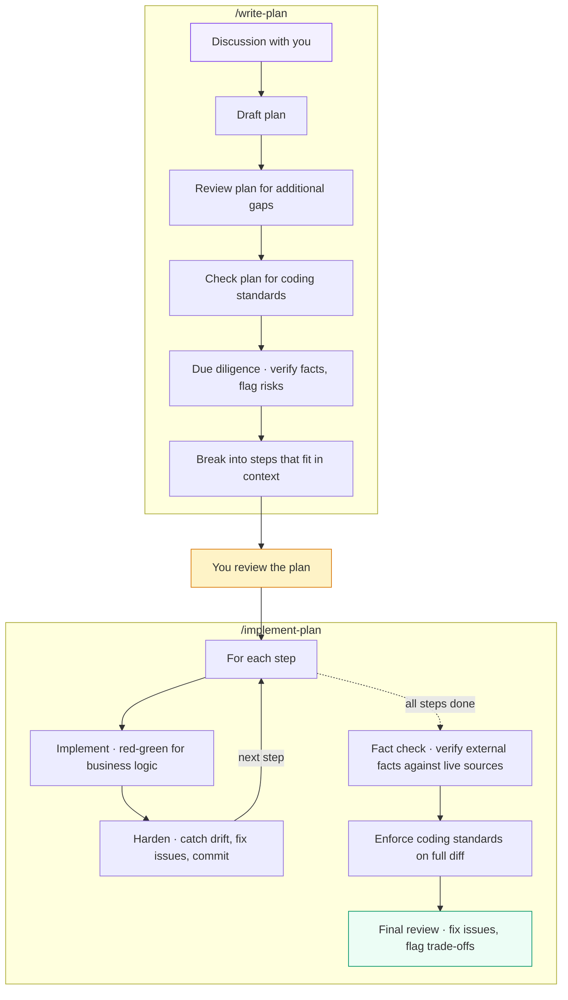

# spec-driven-dev

Your plan, fresh agents, zero drift.

[](#whats-in-this-repo)
[](https://code.claude.com/docs)

A structured workflow for AI-assisted development: from discussion to reviewed, tested, standards-compliant code, through a version-controlled plan. 3 skills, 9 agents, ~1,650 lines of markdown. No code, nothing to configure, no state directories. Just prompts.

## Prerequisites

- [Claude Code](https://code.claude.com/docs) (requires a paid Claude subscription or an API key)
- Every agent pass runs on the model pinned in the agent definitions, currently Opus, regardless of your session's model. The code `/small-change` writes is the exception: your session's model writes it.

## Install

```bash
/plugin marketplace add mkrtchian/spec-driven-dev
/plugin install spec-driven-dev@mkrtchian
```

## Usage

```bash
# 1. Discuss the feature, draft and review the plan
/write-plan                  # or: /write-plan path/to/requirements.md

# 2. Review the plan yourself, adjust if needed

# 3. Commit or stash unrelated work, then execute the plan step by step
/clear
/implement-plan plans/YYYY-MM-DD_my-feature.md
```

```bash
# For a change that doesn't need a reviewed plan, run this in the session where you discussed the change
/small-change Add a --dry-run flag to the export command
```

## The problem

AI coding assistants hit two walls on non-trivial changes:

1. **They don't know what to build.** The more autonomy you give them, the more they drift from your intent. Without a precise spec, you spend more time correcting than you save.
2. **Context degrades.** A single conversation that discusses requirements, writes code, runs tests, and reviews standards will do all of these poorly. The agent loses focus as context fills up, and large changes exceed what fits in one pass.

## The approach

Three skills, each orchestrating fresh agents: every agent starts with its own context window, focused on a single concern.

The review passes run with fresh agents that never saw the code being written. Same principle as human code review, where the reviewer shouldn't be the author. Two writing steps are deliberately not fresh, because both need the discussion: the orchestrator drafts the plan itself, and in `/small-change` the main session writes the code.


```mermaid
flowchart TD
    subgraph "/write-plan"
        A["Discussion with you"] --> B["Draft plan"]
        B --> C["Review plan for additional gaps"]
        C --> D["Check plan for coding standards"]
        D --> DD["Due diligence · verify facts, flag risks"]
        DD --> E["Break into steps that fit in context"]
    end

    E --> F["You review the plan"]

    subgraph "/implement-plan"
        G["For each step"]
        G --> H["Implement · red-green for business logic"]
        H --> I["Harden · catch drift, fix issues, commit"]
        I -- next step --> G

        G -. all steps done .-> FC["Fact check · verify external facts against live sources"]
        FC --> J["Enforce coding standards on full diff"]
        J --> K["Final review · fix issues, flag trade-offs"]
    end

    F --> G

    style A fill:#f3f0ff,stroke:#7c3aed
    style F fill:#fef3c7,stroke:#d97706
    style K fill:#ecfdf5,stroke:#059669
```

`/small-change` drops the plan and keeps the review. Before coding, the main session writes three to five lines of intent (the need, what counts as done, the files it expects to touch), which go in the commit body and stand in for the plan in the fact check and the final review. Once it has written the change, the three passes that end `/implement-plan` review it: fact check, standards, final review.

## Design decisions

**Isolated passes.** A single agent asked to "implement this plan, follow TDD, and check coding standards" will do all three poorly. An agent that just spent 20 minutes implementing code is a poor judge of it: it's biased toward the code it just wrote. The orchestrator is the one context that lives through the whole run, so it stays light: it references its agents by `subagent_type`, and their prompt content never enters it. In `/small-change` the orchestrator is the main session, which writes the code itself, so the code enters its context and only the agents' prompt content stays out. For the detailed rationale and sources, see [design-decisions.md](docs/design-decisions.md).

**Fix what has one answer, flag the rest.** A wrong file path, a type signature that doesn't match the code, a violation of a documented standard: one right answer, so the pass applies it. When the one right answer exceeds what the finding pass may write, like a wrong API field the fact checker would have to restructure code around to correct, the finding is handed to the pass that can apply it, and a fresh pass verifies the result. `/small-change` doesn't hand the finding on, so it comes to you. Anything that rests on a judgment call is never decided for you, it comes back as a remark in the pass report or as a `<!-- REVIEW: ... -->` marker in the plan. On the happy path you are interrupted once per command, at the end.

**Plans in git.** Your plan is a plain markdown file in `plans/`. It goes through your normal PR review process. No state directory, no counters to keep in sync. Two developers can plan and implement different features on different branches without interfering.

**Sequential execution.** Each pass builds on state the previous one verified with whatever test, lint and typecheck commands your project exposes. Simpler to reason about, debug, and review. Parallel execution saves time but adds coordination complexity that isn't worth it for single-feature work.

**Dynamic discovery over configuration.** Agents detect your project's test runner, linter, and standards by reading `CLAUDE.md` and your project's config files. Nothing is hardcoded to a stack.

**Conditional TDD.** Business logic gets test-first. Glue code, wiring, and config changes don't. The line is whether the step has behavior worth pinning down. Applying test-first everywhere produces tests that assert nothing.

**Step hardening.** After each implementation step, a fresh agent verifies alignment with the plan and fixes emergent issues. Problems are caught early, not discovered at the end.

**Conditional security check.** The final review checks security only when the diff touches a trust boundary: an auth check, a secret, a dependency, or outside data reaching a query, a command or a deserializer.

**External facts checked against live sources.** Versions, API fields, endpoints and published identifiers go stale at the model's training cutoff, and a stale fact looks exactly like a correct one. Two gated passes check them against the live web, one on the plan and one on the final diff. The implementer, or the main session in `/small-change`, may look a missing value up rather than invent one. That widens the web surface of a workflow that writes code, which [design-decisions.md](docs/design-decisions.md) names and bounds.

## Example plans

The [mcp-auditor](https://github.com/mkrtchian/mcp-auditor) project was built using this workflow. Its [plans/](https://github.com/mkrtchian/mcp-auditor/tree/main/plans) directory contains 20+ real plans, from domain modeling to CLI UX to OWASP mapping, showing what the output of `/write-plan` looks like in practice.

## Who is this for

- Developers working on non-trivial features where AI "just do it" approaches produce drift and rework
- Teams that do code review and want AI-generated code to go through the same rigor

A single-file fix or a small refactor doesn't need a plan: `/small-change` runs the passes that end `/implement-plan` on code the main session writes. Which changes count as small is your project's call: if your `CLAUDE.md` says which changes need a plan, `/small-change` checks the change against that rule.

## What's in this repo

```
skills/          3 orchestrator skills (/write-plan, /implement-plan, /small-change)
agents/          9 custom agent definitions, one per fresh-agent pass in the diagram above
docs/            Workflow guide, design decisions, framework comparison
plans/           6 plans, produced by running this workflow on itself
```

The agents are distributed with the plugin. Manual installation is not supported: the plugin system resolves the agent references.

## Reliability

In practice, well-structured prompts are followed reliably, though not perfectly. Tests run, TDD is applied, standards are checked. The step hardener catches most of what slips through by verifying each step with fresh context before committing.

These are instructions, not enforced gates, but they are instructions you can read. The implementer is told never to commit, so a fresh agent is the one that verifies the step and commits it. In `/small-change` the main session commits its own change, and each review pass that follows commits its own fixes separately. Every agent that commits has to quote the tail of the real command output ("47 passed, 0 failed") instead of asserting a PASS. No commit path, agent or orchestrator, may use `--no-verify` or `git add -A`. All of these are in the agent and skill files, in plain markdown.

What a pass cannot settle on its own either goes to an agent that can, with a fresh pass verifying the result before it is committed, or comes to you, and a blocked step is never hardened or skipped past. There is no cross-session state: an interrupted run restarts from the top of the plan, with the already-committed steps still in git. Failure paths are in the [workflow guide](docs/workflow.md).

For stronger guarantees on test/lint/typecheck, pair with git pre-commit hooks.

## Contributing

Contributions welcome. [Open an issue](https://github.com/mkrtchian/spec-driven-dev/issues) to discuss before submitting a PR.

## Comparison

Tested in March 2026 on the same feature and repo as [GSD](https://github.com/open-gsd/gsd-core) and [Superpowers](https://github.com/obra/superpowers). All three produced working implementations. The trade-off is speed (~22 min vs ~15 min for the others).

For the full benchmark and detailed analysis, see the **[framework comparison](docs/comparison.md)** (not continuously updated).

## License

MIT. [Roman Mkrtchian](https://github.com/mkrtchian)
